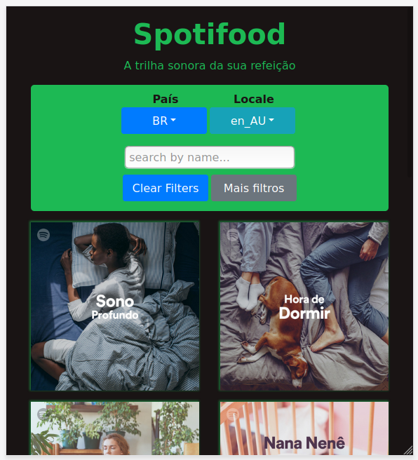

# Spotifood
This application contains 2 major components:
 - A Filter built from iFood's API
 
 - A List of featured playlists fetched from Spotify using the Filter component's values as query



The iFood API provided a lot of filter options and build the Filter component with all of it would make the UI crowded.
The solution was keeping the most important filter visible and hide the others inside a modal, accessible by a "More filters" button

## General
The state is all contained inside App.js and those are:

- **spotifyAccessToken** - Uses CLIENT_ID and CLIENT_SECRET to fetch token which is used to fetch playlists

- **playlists** - Return of fetchFeaturedPlaylist(queryParams) and is a fetch in Spotify API

- **filters** - Return of fetchApiFilters() and is a fetch to the iFood's API

- **search** - Value used to search playlist by name

- **filteredByName** - Playlists filtered by name

- **queryParams** - Built from *filters*, provided to user to change and used as params for playlist fetching

The autheticazion is made via token by the Spotify

## Further improvements
- Use the React's native contextApi to control the application's state and avoid prop drilling
- Make a better UI

Due lack of time, those improvements were not possible

## Runing the project
Clone this repository

*Make sure you are at the branch alekgomes/frontend-test*

Create a ```.env``` file with your Spotify's CLIENT_ID and CLIENT_SECRET (use .env.exemple as example)

Run ```npm install``` command

Run ```npm run dev``` command

Go to localhost:1234

OBS.: I've sent this app CLIENT_ID and CLIENT_SECRET along the email 
